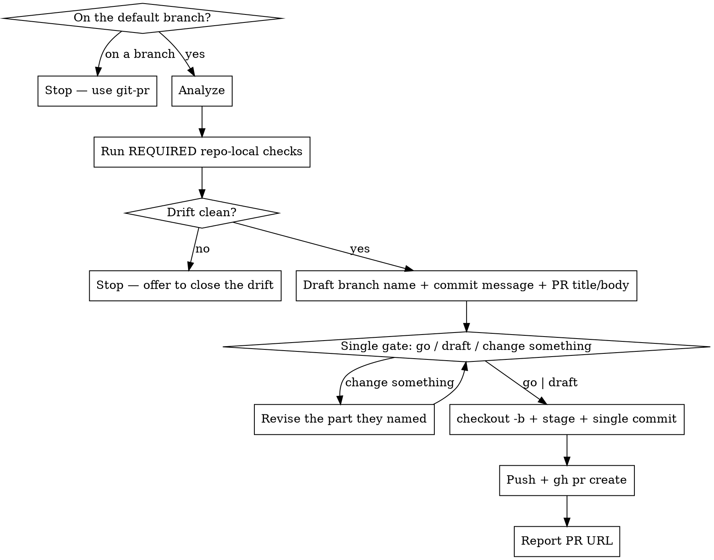

# Branch and PR

Take uncommitted changes sitting on the default branch, move them to a new feature branch as **one commit**, and open a pull request.

Related: `git-pr` opens a PR for a branch that already exists. `git-push-to-main` skips the PR entirely.

## Scripts

Helper scripts in `~/.config/opencode/skills/git-branch-and-pr/scripts/`:

| Script | Purpose |
|--------|---------|
| `analyze-changes.sh` | Status, branch info, default-branch detection, diffs, untracked files, recent commits, repo-local pre-PR checks, README and PR template checks |
| `repo-check.sh list \| run <name>` | List the repo's own declared pre-PR checks, or run one and gate on its result |
| `stage-files.sh [files\|--all]` | Stage files with sensitive-file warnings |
| `create-commit.sh <msg> [--amend]` | Create commit or amend previous (rejects AI attribution) |

The repo declares its own consistency checks — spec drift, stale generated artifacts — in a
`pre-pr:` frontmatter block on one of its `.claude/skills/*/SKILL.md`. `git-pr` documents the
contract in full. Because this skill runs with the work still uncommitted, relevance is judged
against the working tree: staged, unstaged and untracked.

## Workflow


## Steps

### Phase 0: Verify On the Default Branch

1. Check the current branch. If it is NOT the default branch (`main` or `master`), **stop immediately**:
   > "This skill only runs on the default branch. You're on `<branch>`. Use `git-pr` to open a PR for a branch that already has commits."

   Do not proceed.

   **If this is a linked worktree, say so and route them properly.** Detect with:
   ```bash
   [[ "$(git rev-parse --absolute-git-dir)" != "$(git rev-parse --path-format=absolute --git-common-dir)" ]]
   ```
   A worktree-based setup (Orca ADE) puts you on a feature branch from the moment the workspace is
   created, so this skill is *never* reachable there — it is not a failure to work around. `git-pr`
   covers the whole flow instead, including the zero-commits-with-uncommitted-work state a fresh
   worktree starts in (its exit 5). Tell the user that rather than leaving them at a dead end.

### Phase 1: Analyze Repository State

2. Run the analysis script **from the repo root**:
   ```bash
   bash -c 'cd "$(git rev-parse --show-toplevel)" && bash ~/.config/opencode/skills/git-branch-and-pr/scripts/analyze-changes.sh'
   ```

   It outputs git status and branch info, default-branch detection, staged and unstaged diffs, untracked files, recent commits (for style reference), and README / PR template existence.

### Phase 2: Check the Repo's Own Invariants

3. Run every repo-local check the analysis marked **REQUIRED**, before drafting anything:
   ```bash
   bash ~/.config/opencode/skills/git-branch-and-pr/scripts/repo-check.sh run <name>
   ```
   The script applies that check's `fail-on` regex: **0** passed, **1** FAILED, **2** not
   runnable (a gap, not a pass). Relevance is judged against the working tree — staged,
   unstaged and untracked — because nothing is committed yet.

   On **1**, **STOP**. Print the report verbatim, then use `AskUserQuestion`: close the drift
   now (run the owning skill per its `fix` line, re-check, then continue), open the PR anyway
   (only for pre-existing unrelated drift — record it in the body under `## Known drift`), or
   abort. Never close drift on your own; it rewrites checked-in artifacts.

   Skip this phase entirely when the analysis found no REQUIRED checks; do not invent one.

   This runs **before** the branch exists so that a drift stop costs nothing to unwind — there is
   no branch to delete and no commit to amend.

### Phase 3: Draft Everything

4. Draft all three pieces before asking anything. Nothing is created yet — this phase only writes text.

   - **Branch name** — short, descriptive, kebab-case, from the diff (e.g. `add-auth-middleware`, `fix-cache-eviction`)
   - **Commit message** — one commit covering the whole change, in the repo's prevailing style
   - **PR title and body** — title under 70 chars; body from the repo's PR template if one exists, otherwise:
     ```
     ## Summary
     <1-3 bullets explaining what changed and why>

     ## Changes
     <grouped list of specific changes — by file or area>

     ## Test plan
     <how to verify this works — manual steps, test commands>
     ```

   Base the PR text on the same working-tree diff the commit will contain. There is no branch to
   diff against yet, so do not run `git log`/`git diff` against a merge-base here — the commit
   you are about to make *is* the whole PR.

5. If README.md exists, check whether the changes affect documented content and update it if so — only for meaningful user-visible changes. Do this now, so the edit is part of the one commit.

### Phase 4: The Single Gate

6. Print all three as ordinary text, together, in one block:

   ```
   branch:  fix-cache-eviction
   commit:  fix(cache): evict stale entries on write

   PR title: fix(cache): evict stale entries on write
   PR body:
   <the full body>
   ```

   Then put it to the user with **exactly one `AskUserQuestion`** — the only stop on a clean run:

   | Option | Action |
   |---|---|
   | **Go** | Create the branch, commit, push, and open the PR ready for review |
   | **Open as draft** | The same, with `gh pr create --draft` |
   | **Change something** | They say which part via Other — branch name, message, or PR text. Revise that piece, reprint the block, and put it back through this same dialog |

   **That answer authorises everything downstream: the branch, the commit, the push, and the PR.**
   Do not confirm the branch name, then the message, then the PR body — that is one decision
   presented three times. Do not follow the answer with a "ready to open it?" or a separate
   draft-or-ready question either. Draft-vs-ready lives in this dialog and nowhere else.

### Phase 5: Create the Branch and the Commit

7. ```bash
   git checkout -b <branch-name>
   ```
   The uncommitted changes come with you — no stash needed.

8. Stage files:
   ```bash
   bash ~/.config/opencode/skills/git-branch-and-pr/scripts/stage-files.sh --all
   ```
   Or name specific files.

9. Create the one commit:
   ```bash
   bash ~/.config/opencode/skills/git-branch-and-pr/scripts/create-commit.sh "<the confirmed message>"
   ```
   The script rejects AI attribution.

### Phase 6: Push and Create the PR

10. ```bash
    git push -u origin $(git branch --show-current)
    ```
    ```bash
    gh pr create --base <default> --title "<title>" --body-file <path>
    ```
    Write the confirmed body to a file rather than inlining a heredoc — it avoids quoting surprises in long bodies. Add `--draft` when Phase 4 came back **Open as draft**, or when the user asked for a draft in their original request.

11. Output the PR URL.

## Rules

- Run only from the default branch — refuse in Phase 0 otherwise
- **Single commit**: this skill creates exactly one commit on the new branch. For more commits afterwards, use `git-push-branch` from that branch
- **One gate on a clean run: the Phase 4 dialog.** Branch name, commit message, and PR text are drafted together, shown together, and approved together — one answer authorises the branch, the commit, the push, and the PR. The only other dialog is the exception in Phase 2, when a REQUIRED check fails
- **Every decision goes through `AskUserQuestion`, never a question in prose.** A text question reads as a sign-off — the turn looks finished and the user can't tell anything is pending. The dialog renders as something to select and submit. Ordinary text is for showing the proposed content and for the final summary
- NEVER create the branch, commit, push, or open the PR before that dialog comes back
- NEVER open the PR with a REQUIRED repo-local check failing, unless the user explicitly picked "open anyway" and the drift is recorded in the PR body
- NEVER close drift on the user's behalf — running the fix rewrites checked-in artifacts, which needs their say-so
- NEVER include "Co-Authored-By" or any "Claude Code" / AI attribution in commits **or** in the PR body
- NEVER force-push
- Nothing is created before Phase 4 answers: no branch, no commit, no push. Drafting is text only
- The PR description must accurately reflect the full diff; group by area if the diff is large
- Keep Summary on the "why", Changes on the "what"
- Use conventional commit style if the repo uses it
- Only update README when changes meaningfully affect documented content
- Do not add `--draft` unless Phase 4 came back **Open as draft** or the user asked for one up front

## Common mistakes

- **Running this on a feature branch.** That is `git-pr`.
- **Fabricated description.** Summarize the real diff, not a guess at what the change probably does.
- **Approving one thing at a time.** Branch name, then message, then PR body is three dialogs for one decision. Draft all three, show them in one block, ask once.
- **Creating the branch before the gate answers.** Renaming afterwards is avoidable churn, and a drift stop should never leave a stray branch behind.
- **Asking in prose instead of `AskUserQuestion`.** "Use this branch name?" at the end of a message looks like the turn is over; the user doesn't know a decision is waiting on them.
- **Expecting multiple commits.** This skill makes exactly one.
- **Skipping Phase 2 because the analysis output was long.** A REQUIRED repo-local check is the repo telling you this diff can break an invariant CI does not cover. Gate on `repo-check.sh run`'s exit code, not on how the report reads.
- **Putting AI attribution in the PR body.** The commit script blocks it in commits; the same rule applies to anything published to GitHub.
