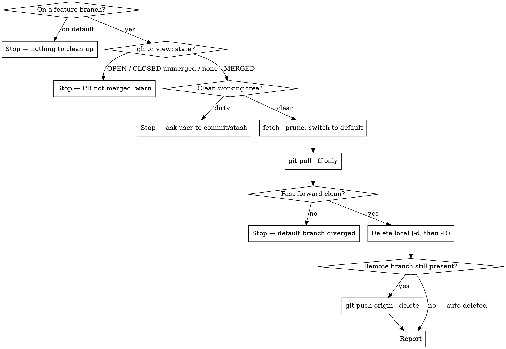

# Post-Merge Cleanup

Confirm the PR for the current branch genuinely merged, then delete the branch and refresh the default branch. Two steps, in this order and only this order.

**The merge check is a hard gate, not a formality.** Deleting a branch whose work is not upstream is data loss — the commits become unreachable. Nothing destructive runs until `verify-merged.sh` exits 0.

## Scripts

Helper scripts in `~/.config/opencode/skills/git-cleanup/scripts/`:

| Script | Purpose |
|--------|---------|
| `verify-merged.sh` | The gate: PR state must be `MERGED` with a non-null `mergedAt`; also checks branch and tree state |
| `cleanup-branch.sh <branch> <default> --merge-verified` | Refresh default branch, delete local + remote branch. Refuses to run without the flag. Worktree-aware — see below |

## Why the merge check cannot be softened

| PR state | `mergedAt` | Meaning | Action |
|---|---|---|---|
| `MERGED` | non-null | Work is on the default branch | **Proceed** |
| `OPEN` | null | Never merged | **Stop.** Deleting throws away the only copy |
| `CLOSED` | null | Closed *without* merging — abandoned, not landed | **Stop and warn loudly.** Deleting = data loss |
| (no PR) | — | gh found nothing | **Stop.** Do not assume it merged |

`gh pr view` is authoritative. The local commit graph is **not**: after a squash or rebase merge — GitHub's common modes — the branch's commits are not ancestors of the default branch, so the graph looks unmerged even though the PR landed cleanly. That is exactly why step 3 needs a `-D` fallback, and why the gh check rather than `git branch -d`'s opinion is what decides safety.

## Workflow



## Steps

### Phase 1: Verify the PR Merged

1. Run the gate from the repo root:
   ```bash
   bash -c 'cd "$(git rev-parse --show-toplevel)" && bash ~/.config/opencode/skills/git-cleanup/scripts/verify-merged.sh'
   ```

2. Act on the exit code. **Only exit 0 proceeds.**

   | Exit | Meaning | What to do |
   |---|---|---|
   | 0 | PR `MERGED`, tree clean | Continue to Phase 2 |
   | 2 | On the default branch | Stop. Ask with `AskUserQuestion` which branch they meant |
   | 3 | No PR for this branch | Stop. Do not assume it merged. Ask with `AskUserQuestion` how to proceed |
   | 4 | PR still `OPEN` | Stop. Tell the user, then offer `git-merge-pr` as an option in an `AskUserQuestion` |
   | 5 | PR `CLOSED` without merging | **Stop and warn.** The work is not upstream. Require an explicit `AskUserQuestion` go-ahead before anything destructive |
   | 6 | Dirty working tree | Stop. Show exactly what is uncommitted, then ask with `AskUserQuestion` — commit or stash. Do not stash for them |
   | 1 | No gh / not a repo | Stop and report |

   Record `branch` and `default` from the script's output — you are about to leave the branch and cannot read it off `HEAD` afterwards.

### Phase 2: Refresh the Default Branch and Delete

3. Run the cleanup:
   ```bash
   bash ~/.config/opencode/skills/git-cleanup/scripts/cleanup-branch.sh <branch> <default> --merge-verified
   ```

   It fetches with `--prune`, switches to the default branch, pulls `--ff-only`, deletes the local branch (`-d`, falling back to `-D`), and deletes the remote branch if GitHub did not already auto-delete it.

   **In a linked worktree (Orca ADE) it does less, deliberately.** Two of those steps are
   impossible there: the default branch is checked out in the main checkout so it cannot be
   switched to, and `<branch>` is the branch this worktree is standing on so git will not delete
   it. The script detects the worktree, fast-forwards the default **by ref** instead of switching,
   deletes the remote branch as usual, and then prints:

   ```
   orca worktree rm --worktree active
   ```

   That command removes the worktree and its local branch together. Surface it to the user — do
   not run it for them, and do not report the branch as deleted when only the remote one was.

4. If it exits **10**, the local default branch has diverged from origin — someone committed directly to it. The branch was **not** deleted. Do not force anything. Surface the divergence to the user (it usually means a commit landed by mistake), resolve it with them using the conflict procedure in `git-sync`, then re-run Phase 2.

### Phase 3: Report

5. State plainly:
   - the PR number + URL, and that it was confirmed **MERGED** (with `mergedAt`)
   - the branch deleted, and whether the local delete was safe (`-d`) or forced (`-D`, squash/rebase merge)
   - whether the remote branch was deleted here or had already been auto-deleted
   - the default branch's new HEAD

## Rules

- **Every decision goes through `AskUserQuestion`, never a question in prose.** A text question reads as a sign-off — the turn looks finished and the user can't tell anything is pending. The dialog renders as something to select and submit. Ordinary text is for showing what was found and for the final report
- Refuse to delete anything until `verify-merged.sh` exits 0 — no exceptions, no "it's probably merged"
- Never pass `--merge-verified` to `cleanup-branch.sh` on the strength of a guess
- Never use `-D` as the default delete; it is a fallback licensed by the verified `MERGED` state alone
- Treat `CLOSED` as **not merged** — a closed PR was usually abandoned
- Require a clean working tree; never stash on the user's behalf without being asked
- Never force-push or force-pull to resolve a diverged default branch
- Never rewrite the default branch

## Common mistakes

- **Deleting before confirming MERGED.** The entire point of this skill. Phase 1 gates everything.
- **Trusting `git branch -d`'s "fully merged" opinion.** After a squash or rebase merge the branch commits are not ancestors of the default branch, so `-d` refuses on work that *did* land. Let gh decide, then `-D`.
- **Reaching for `-D` by default.** It force-deletes regardless of merge state — a silent data-loss button.
- **Treating CLOSED as MERGED.** `mergedAt` null means not merged, full stop.
- **Trying to delete the branch you are standing on.** Switch to the default branch first; git refuses otherwise.
- **Cleaning up into a dirty tree.** Switching branches with uncommitted changes tangles them into the wrong branch.
- **`git pull` without `--ff-only`.** A plain pull can invent a surprise merge commit on the default branch when it has diverged.
