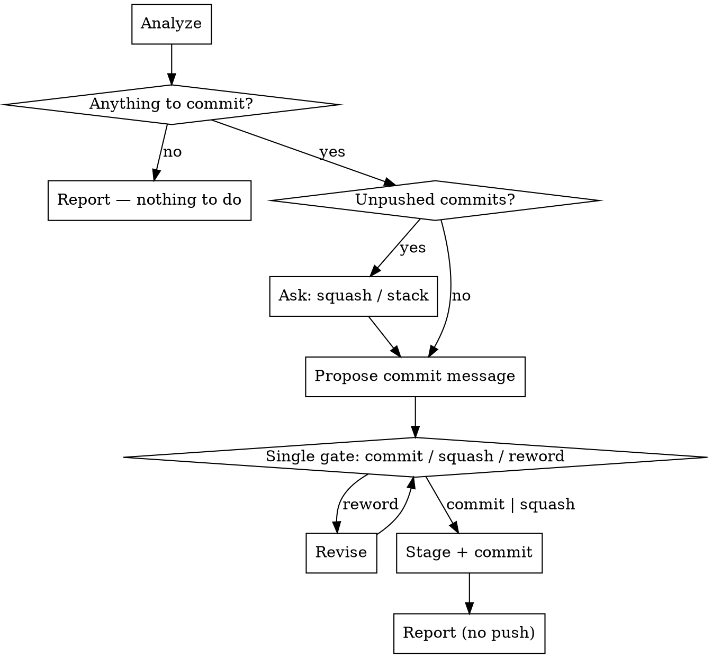

# Commit

Analyze the uncommitted changes and create a commit on whatever branch you are on. **This skill never pushes** — that is deliberate.

Related: `git-push-branch` commits *and* pushes on a feature branch. `git-push-to-main` does the same on the default branch.

## Scripts

Helper scripts in `~/.config/opencode/skills/git-commit/scripts/`:

| Script | Purpose |
|--------|---------|
| `analyze-changes.sh` | Status, unpushed commits, staged/unstaged diffs, untracked files, recent commits, README check |
| `stage-files.sh [files\|--all]` | Stage files with sensitive-file warnings |
| `create-commit.sh <msg> [--amend]` | Create commit or amend previous (rejects AI attribution) |

## Workflow



## Steps

### Phase 1: Analyze Repository State

1. Run the analysis script **from the repo root** to get the full picture:
   ```bash
   bash -c 'cd "$(git rev-parse --show-toplevel)" && bash ~/.config/opencode/skills/git-commit/scripts/analyze-changes.sh'
   ```

   It outputs git status, unpushed commit count and list, staged and unstaged diffs, untracked files, recent commits (for style reference), and whether a README exists.

### Phase 2: Note the Unpushed Commits

2. If there are unpushed commits, say so in the summary — how many, and what the last one was.
   Squash-versus-stack is **not** a separate question: it rides in the Phase 3 dialog as an option.

   If the previous commit was already pushed, amending rewrites published history and the eventual push will need `--force-with-lease`. Say so in that summary, before the dialog offers squash.

### Phase 3: Review and Propose a Commit Message

3. Summarize the changes for the user: what files changed, what the changes do.

4. **Auto-propose a commit message** based on the diff. Show the full message as ordinary text, then put it to the user with **one `AskUserQuestion`** — the only stop in this skill, carrying both the message and where it lands:

   | Option | Action |
   |---|---|
   | **Commit it** | Stage and commit with the message shown. When unpushed commits exist, this is the **stack** choice — a new commit on top |
   | **Squash into the last commit** | Only offered when there are unpushed commits. `create-commit.sh --amend` with the message shown |
   | **Reword** | They type the replacement via Other; commit with that |

   With no unpushed commits, drop the squash option — the dialog is then just *commit this message or reword it*. Never commit without that answer, and never split the history choice and the message into two dialogs.

5. If README.md exists, check whether the changes affect documented content — new features, changed commands or structure, removed functionality. Update it only for meaningful user-visible changes, not for minor fixes, refactors, or internal work.

### Phase 4: Stage and Commit

6. Stage files:
   ```bash
   bash ~/.config/opencode/skills/git-commit/scripts/stage-files.sh --all
   ```
   Or name specific files:
   ```bash
   bash ~/.config/opencode/skills/git-commit/scripts/stage-files.sh file1.js file2.js
   ```

7. Create the commit with the confirmed message:
   ```bash
   bash ~/.config/opencode/skills/git-commit/scripts/create-commit.sh "commit message here"
   ```
   Add `--amend` when the dialog came back **Squash into the last commit**.
   Or amend for the squash case:
   ```bash
   bash ~/.config/opencode/skills/git-commit/scripts/create-commit.sh "updated message" --amend
   ```
   The script refuses any message containing AI attribution.

### Phase 5: Report

8. State the commit and the branch. Say plainly that nothing was pushed, and how many unpushed commits now exist.

## Rules

- Continue to the next phase automatically if the current phase completes without errors
- **One gate: the commit-message dialog.** It carries the message *and* the squash-versus-stack choice. Never ask about squashing first and the message second — that is one commit, so it is one question
- **Every decision goes through `AskUserQuestion`, never a question in prose.** A text question reads as a sign-off — the turn looks finished and the user can't tell anything is pending. The dialog renders as something to select and submit. Ordinary text is for showing the proposed message and for the final report
- Always propose a commit message and wait for the dialog answer (or their replacement) before running `create-commit.sh`
- NEVER include "Co-Authored-By" or any "Claude Code" / AI attribution in commit messages — the script rejects them
- NEVER run `git push` — that is `git-push-branch` or `git-push-to-main`
- Warn before amending a commit that was already pushed
- When squashing, use `--amend` to combine changes into the previous commit
- Keep commit messages short and focused on the "why"
- Use conventional commit style if the repo uses it
- Only update README when changes meaningfully affect documented content
- The stage-files.sh script warns about sensitive files (.env, .pem, .key, etc.)

## Common mistakes

- **Pushing.** This skill commits and stops. If the user wants it pushed, that is a different skill.
- **Committing without proposing the message.** The confirmation step is not optional.
- **Splitting one commit across two dialogs.** Squash-or-stack and the message are decided together, in the Phase 3 dialog.
- **Asking in prose instead of `AskUserQuestion`.** "Use this message?" at the end of a message looks like the turn is over; the user doesn't know a decision is waiting on them.
- **Amending an already-pushed commit silently.** It rewrites published history and needs a force-push later.
- **Staging sensitive files.** Let `stage-files.sh` do the staging; it filters `.env`, `.pem`, `.key` and friends.
- **Padding the README for a refactor.** Only user-visible changes belong there.
