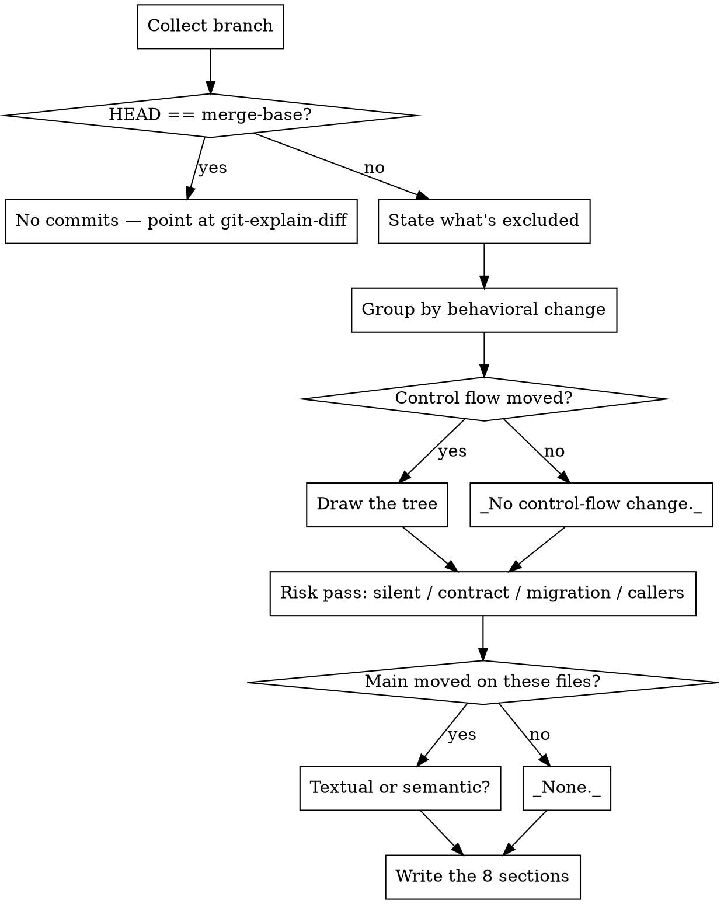

# Explain the branch against main

<!-- The rendering contract below (spine, column 90, notation, consequence leaf) is
     duplicated in git-explain-diff/SKILL.md. Change both together. -->

Produce one thing: what **main does today** versus what **this branch does**, one
behavioral change at a time, carried down to the thing that will visibly behave
differently — followed by the parts that are risky, incomplete, or about to collide with
work that landed on main while you were away.

The framing is before/after against main, not "here is the diff". A reader who wanted the
diff would have run `git diff`.

**Core principle: the commit log is evidence, not truth.** A message describing an approach
abandoned three commits later is normal, not exceptional. Every claim taken from a message
gets checked against the final three-dot diff before it is written down.

## When to use

- "What does this branch actually change?"
- "Summarize my branch before I open the PR"
- "Is anything in here risky / did I break a contract?"

**Not this skill:**
- Uncommitted working-tree changes → `git-explain-diff`
- An approve/block verdict before landing → gstack `/review`
- Merging main in / resolving conflicts → `git-sync`

## Workflow



## Collect it in one call

```bash
bash ~/.config/opencode/skills/git-explain-branch/scripts/collect-branch.sh
```

Accepts `--no-fetch` (offline, or already fetched), `--base <ref>` (compare against
something other than the detected default branch), and `--max-lines N`. It resolves the
default branch and the merge-base, fetches, lists the commits, the three-dot stat and diff
with `-M -C`, everything **excluded** from the scope, files that net to zero, the
`COUNTED, NOT READ` list, and the collisions with main.

Read its whole output before writing a word of the answer.

## Four rules that make the explanation correct

### 1. Three dots for `diff`, two dots for `log`

The single most damaging mistake available here, because the output looks completely normal:

| Command | Gives you |
|---|---|
| `git diff main...HEAD` | **correct** — your work only; identical to `git diff $(git merge-base main HEAD) HEAD` |
| `git diff main..HEAD` | wrong — main's commits appear as *your deletions* |
| `git log main..HEAD` | **correct** — your commits only |
| `git log main...HEAD` | wrong — symmetric difference, main's commits listed as yours |

The convention inverts between the two commands, which is why it is so easy to get
backwards. With the two-dot form of `diff`, a rate limiter a teammate added to main last
week reads as a rate limiter *you deleted*, and the explanation states it with complete
confidence. The script only ever uses the correct form of each; if you run git by hand,
check the dots before believing the output.

### 2. Say what is not in the scope

Three things are missing from that diff by construction, and each one has to be stated in
`## Scope` rather than quietly assumed:

- **Uncommitted work.** The branch diff covers commits. Anything in the working tree is
  excluded — the script lists it. Point at `git-explain-diff` for it.
- **Work reverted inside the branch.** A file written in commit 2 and reverted in commit 7
  nets to zero and appears in no diff, though the log still shows both. The script reports
  these as `TOUCHED BUT NET-ZERO`. Mention them only if the user asks what they *did*, and
  never describe them as part of the change.
- **Files counted but not read** — binary, lockfiles, generated output, oversized.

### 3. Re-derive every line number from the branch tree

Cite `relative/path.ext:LINE` anchored on a symbol in the file as it exists on this branch
now, not on a number from a `@@` header — those are pre-image for the `-` side and
post-image for the `+` side, and mixing them silently sends the reader to the wrong
function. For a line the branch deleted, mark it: `server/webhook.go:31 (pre-image, <base-sha>)`.

Name the branch you explained, and confirm it is still checked out when you finish
(`git rev-parse --abbrev-ref HEAD`). A checkout mid-explanation swaps the tree underneath
you and produces an answer that is internally consistent and entirely wrong.

### 4. Every change ends in something observable

A change may not be left at "refactored the webhook handler" or "improved validation". It
ends in a different value returned, a different SQL statement or outbound request, a
different rendered output, a different error, a different startup requirement — or an
explicit `no observable change — <why>` for a pure rename, a formatter pass, or dead code.

## The risk pass

Explanation first, then this. Five questions, each answered from the diff:

- **What changed silently?** An altered default, a changed error path, a removed guard or
  validation, a widened permission, a changed timeout, retry count, or ordering. These are
  the ones nobody reviews, because the diff is three lines.
- **What contract moved?** Anything a consumer *outside this branch* depends on: API
  request or response shape, DB schema, config keys, env vars, exported signatures, CLI
  flags, queue message formats. Name who breaks — an existing client, a sibling service, a
  deploy script.
- **What is irreversible?** Destructive DDL, data migrations, backfills. Check the ordering
  is deploy-safe (add column → deploy → backfill → drop, not all in one release) and say
  whether a rollback is possible at all.
- **What is the blast radius?** For every changed exported signature, grep its callers
  across the whole repo and check each against the diff:

  ```bash
  grep -rn "verifySignature" --include='*.go' . | grep -v _test
  ```

  A caller not in the diff was not updated. Same for renamed config keys and env vars,
  where the "caller" is a template, a chart, or a CI file.
- **What did main gain meanwhile?** The script runs
  `git log --oneline <base>..origin/<default> -- <changed paths>`. A textual conflict is the
  cheap half — `git-sync` will surface it. The half worth writing down is the **semantic**
  one, where both sides merge clean and the behavior breaks anyway: main adds a caller of
  the function whose signature you changed, or moves the validation you were relying on.

## Output template

The answer IS this document. Eight headings, verbatim and in this order. Keep every
heading, even when the section is empty — an absent heading reads as "I didn't look".

````markdown
## Scope

Branch, default branch, merge-base sha, and the counts: N commits, M files, `+A/−B`.
Then what is **excluded**: uncommitted work (with a pointer to `git-explain-diff`), merge
commits, files counted but not read with the reason, and any net-zero files. If `--no-fetch`
was used or the fetch failed, say the collision check is only as fresh as the last fetch.

## What this branch does

Two to four sentences of prose, no bullets. The PR description's first paragraph. If the
branch does two unrelated things, say so here in a clause rather than blending them.

## Changes (N)

One `### N. <what behaves differently>` per behavioral change, most consequential first —
not one per file, not in path order, and not one per commit. Under each:

> **main today** — a POST to `/webhook` is processed whoever sent it.
> **this branch** — an unsigned POST is rejected with 401 before any handler runs.

then the files and `path:LINE` that carry it. A change spanning five files is one entry.

## Call-flow deltas

Only where control flow actually moved; otherwise `_No control-flow change._` and keep the
heading.

**An indented tree, never a table.** Indentation is the point: a deeper line is a step
*into*, a shallower line is a step back *out*. The spine is two columns in one code fence —
glyphs, symbol, `(full/relative/path:LINE)`, `·` leader, and the description starts at
**column 90** and never moves. Pad mechanically (`dots = 87 − len(locator)`). A subtree that
would overflow gets split out with `↳`; the column does not widen.

| Mark | Means |
|---|---|
| `+` | a frame that did not exist on main |
| `−` | a frame that no longer runs — drawn at the indent it used to occupy |
| `~` | same frame, changed body |
| `=` | unchanged, shown only because the change is unreadable without it |
| `⇢` | step into another file — a real stack frame, so it is a child node, not an arrow in the description |
| `↩` `⑂` `↻` `↳` | early return · branch (draw both arms) · loop (say what it iterates) · continues in another tree |

The consequence hangs off its node as a labelled box, breaking out of the alignment because
it is content to stop and read rather than skim. Against main, the two sides are labelled
`main` and `branch`:

```
└─ = HandleWebhook (server/webhook.go:88) ·············································· entry unchanged; both arms below are new
   ├─ + verifySignature (server/webhook.go:94) ········································· added by 2 of the 4 commits on this branch
   │  └─ ⇢ internal/crypto/hmac.go:31 ·················································· constant-time compare, not ==
   │     ┌─ BEFORE/AFTER ─────────────────────────────────────────────┐
   │     │ main    any POST to /webhook is processed                  │
   │     │ branch  a POST without a valid X-Sig header gets 401       │
   │     │ visible existing senders that never signed now fail —      │
   │     │         this is a contract change, see ## Contracts & risk │
   │     └────────────────────────────────────────────────────────────┘
   └─ ~ dispatch (server/webhook.go:120) ··············································· unchanged body, now unreachable without a signature
```

Size each box to its own longest line; do not stretch them all to one width.

## Contracts & risk

| # | Change | Kind | Who breaks | Reversible |
|---|---|---|---|---|

One row per item from the risk pass. Kind is `silent behavior` / `API` / `schema` /
`config` / `signature` / `migration`. **Who breaks** names a real consumer — "existing
webhook senders", "the deploy script's `--legacy` flag", "`cmd/backfill`" — never "callers".
Reversible is `yes`, `yes, with a redeploy`, or `no` with the reason. Empty is a real
answer: `_Nothing outside this branch depends on what changed._`

## Collisions with main

Commits that landed on the default branch since the merge-base and touch files this branch
also changes, with the overlapping files. For each, say whether the risk is textual (
`git-sync` will show it) or **semantic** (merges clean, behavior breaks) — the second kind
is the reason this section exists. `_None — no main commit touches these files since <base-sha>._`

## Gaps

Bulleted. Callers not updated (file:line, from the grep), new behavior with no test
touched, a contract change with no doc or CHANGELOG line, a migration with no rollback.
`_None._` is a real answer.

## Verify it yourself

Four to six commands the user can paste, most useful first — the caller grep, the diff of
the one file that matters, `git diff <base>...HEAD --stat`, `git log <base>..origin/main`.
Not a generic git tutorial.
````

## Common mistakes

| Mistake | Consequence |
|---|---|
| `git diff main..HEAD` (two dots) | Main's own commits show up as your deletions; the explanation is confidently backwards |
| `git log main...HEAD` (three dots) | Symmetric difference — main's commits get attributed to this branch |
| Comparing against `main` instead of the merge-base | Same failure as two-dot diff whenever main has moved since you branched |
| Not saying uncommitted work is excluded | The user believes this covers their working tree; it never does |
| Trusting a commit message over the final diff | Describes an approach abandoned three commits later |
| Describing net-zero work as part of the change | It was written and reverted; nothing in the merged result reflects it |
| Taking a line number off a `-` hunk line and citing it as current | Pre-image number; the reader lands in the wrong function and trusts it |
| One `### ` entry per commit or per file | Splits one behavioral change across five entries and buries the risky one |
| Walking the diff in path order | The reader reassembles the change themselves, which was the job |
| Ending a change at "refactored X" / "tightened validation" | No consequence, so the reader cannot tell what will behave differently |
| Skipping the caller grep on a changed signature | Ships half a change; it breaks at runtime rather than here |
| Not checking what main gained | Misses the semantic conflict that merges cleanly and breaks anyway |
| Filling `Who breaks` with "callers" or "consumers" | Unactionable — the point of the row is the specific thing that will fail |
| Silently dropping lockfiles, binaries, generated output | Reads as full coverage; a real change hiding in generated output goes unmentioned |
| Treating a rename with edits as a delete plus an unrelated new file | Invents a removal that never happened and loses the file's history |
| Rendering the call flow as a numbered table | Flattens the stack — a table cannot show a step *into* versus a return back *out* |
| Hand-counting the leader dots | Drifts by one or two on long trees, which distracts more than no alignment would |
| Turning it into an approve/block review | That is `/review`. This skill explains; the user decides. |
| Committing, merging, rebasing, or pushing anything | Read-only apart from `git fetch`, which moves remote-tracking refs and nothing else |
