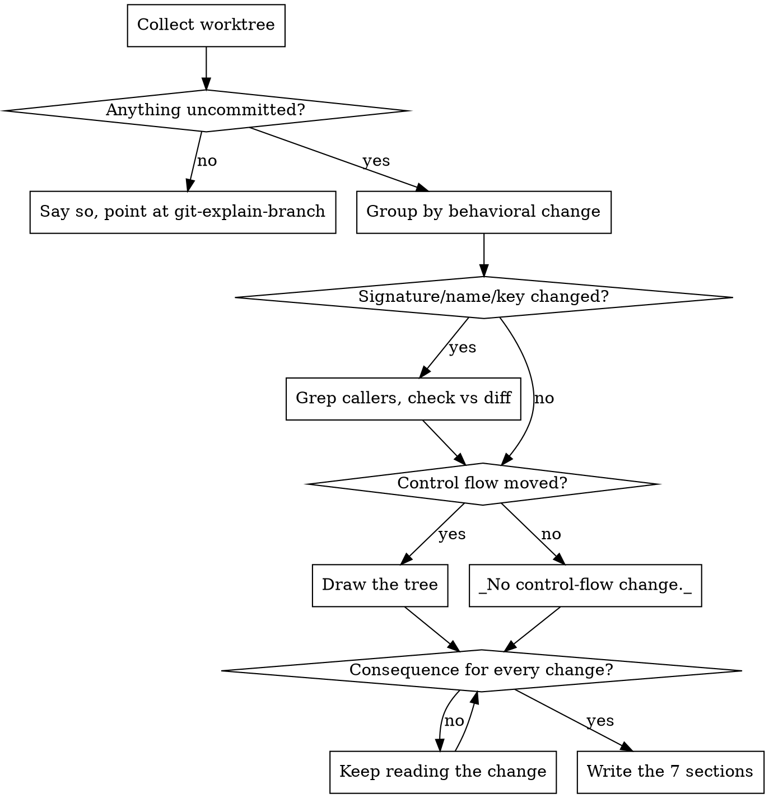

# Explain the uncommitted diff

<!-- The rendering contract below (spine, column 90, notation, consequence leaf) is
     duplicated in git-explain-branch/SKILL.md. Change both together. -->

Produce one thing: an account of what is sitting in the working tree **right now** —
staged, unstaged, and untracked alike — ordered by what the change *does*, carried down to
the thing that will visibly behave differently, and explicit about the parts that are
unfinished or accidental.

The reader is usually someone who has partly lost the thread: they came back to a branch
after two days, or an agent edited eleven files, and they need to know what is in here
before they commit it. "Modified `create.go` and `validate.go`" is the sentence this skill
exists to replace.

**Core principle: nothing is explained from memory.** Not from earlier in this
conversation, not from the plan that produced the edits, not from a commit message. If the
implementation drifted from the intent — and it usually did — only the diff knows. Read it.

## When to use

- "What's in my working tree / what did I change?"
- "Explain this diff before I commit it"
- "Did I leave any debug junk in here?"

**Not this skill:**
- Branch vs the default branch → `git-explain-branch`
- Creating the commit → `git-commit`
- Pre-landing judgment (approve/block) → gstack `/review`

## Workflow



## Collect it in one call

```bash
bash ~/.config/opencode/skills/git-explain-diff/scripts/collect-worktree.sh
```

Accepts `--max-lines N` (per-file diff size above which a file is counted, not read;
default 800) and `--max-bytes N` (untracked-file size cap; default 60000). It emits
branch and upstream state, `--porcelain=v2` status, staged and unstaged stat + diff with
`-M -C`, **the untracked files with their contents**, assume-unchanged / skip-worktree
paths, submodule pointers, and a `COUNTED, NOT READ` list.

Read its whole output before writing a word of the answer.

## Four rules that make the explanation correct

### 1. Three populations, and `git diff` shows only two

| Population | Where it lives |
|---|---|
| staged | `git diff --cached -M -C` |
| unstaged | `git diff -M -C` |
| **untracked** | nowhere in `git diff` — `git ls-files --others --exclude-standard` |

**A brand-new file is invisible to `git diff`, and a brand-new file is usually the entire
point of the change.** An explanation assembled from `git diff` alone omits the new module
and then confidently describes the leftovers as the change. The script prints untracked
contents for exactly this reason; if you ever run `git diff` by hand instead, run
`git status --untracked-files=all` beside it.

Two more populations that hide even from the script's diffs, both reported separately:
**assume-unchanged / skip-worktree** paths, whose edits git deliberately never shows, and
**submodules**, which show as a one-line pointer move with the real work in another repo.

### 2. Re-derive every line number from the working tree

Cite `relative/path.ext:LINE` and anchor it on a symbol, in the file as it exists now:

```bash
grep -n "^func validateTotals\|^def validate_totals" service/invoice/create.go
```

Numbers taken off a `@@ -140,7 +140,9 @@` header are **pre-image** for the `-` side and
**post-image** for the `+` side. Mixing them silently is how a reader lands three functions
away from the change and believes it. For a line that no longer exists, say so:
`service/invoice/validate.go:38 (pre-image, HEAD)`.

### 3. Order by intent, then by execution — never by path

`git diff` emits files alphabetically, which is the worst available reading order:
it splits one change across four files and interleaves it with an unrelated one. Group the
answer by **behavioral change**, most consequential first, and inside each change follow
the call rather than walking the files.

### 4. Every change ends in something observable

A hunk that changes a default is not the story. The story is what behaves differently when
the code runs. A change may not be left at "refactored the handler", "updated the config",
or "improved validation" — it ends in a different value returned, a different SQL statement
or outbound request, a different rendered output, a different error, or an explicit
`no observable change — <why>` for a pure rename, a formatter pass, or dead code.

If you cannot state the consequence, you have not finished reading the change.

## Check whether the change is actually finished

This is the highest-value thing the skill does, and it is the one the user cannot do by
skimming. For every symbol whose **signature, name, or return shape** changed, find its
callers and check each one against the diff:

```bash
grep -rn "validateTotals" --include='*.go' . | grep -v _test
```

A caller that is *not* in the diff is a caller that was not updated — the change is
half-shipped, and it will surface at runtime or in CI rather than here. Say which file and
line. Do the same for renamed config keys, changed env vars, and altered API field names,
where the "caller" is a template, a YAML file, or a client.

While you have the diff open, also collect the **accidental content**: debug prints and
`console.log`, commented-out blocks, `.only` / `fit` / `xdescribe` left in tests, hardcoded
URLs, tokens or absolute local paths, a version bump nobody asked for, stray `TODO`, and
pure-formatter churn mixed into a logic file. Each one is a line in `## Loose ends`, not a
paragraph.

## Output template

The answer IS this document. Seven headings, verbatim and in this order. Keep the heading
even when a section is empty — a missing heading reads as "I didn't find anything" and an
absent one reads as "I didn't look".

````markdown
## Scope

Branch, upstream state, and the counts: N staged / N unstaged / N untracked, `+A/−B`.
Then, on its own line, every file that was **counted but not read**, with the reason
(binary, lockfile, generated, oversized) — plus any assume-unchanged or submodule paths.
A truncation the reader cannot see reads as full coverage.

## What you were doing

Two to four sentences of prose. No bullets. The sentence you would say in standup, with
enough specificity that the user recognizes their own work in it. If the tree holds two
unrelated efforts, say that here in one clause rather than blending them into a fiction.

## Changes (N)

One `### N. <what behaves differently>` per behavioral change, most consequential first —
not one per file, and not in path order. Under each: one line of **before** and one of
**after**, then the files and `path:LINE` that carry it. A change spanning four files is
one entry; four unrelated one-line edits are four entries.

## Call-flow deltas

Only for changes where control flow actually moved. Value tweaks, copy changes and new
tests do not get a tree — write `_No control-flow change._` and keep the heading.

**An indented tree, never a table.** Indentation is the point: a deeper line is a step
*into*, a shallower line is a step back *out*. The spine is two columns inside one code
fence — glyphs, then the symbol, then `(full/relative/path:LINE)`, then a `·` leader, and
the description starts at **column 90** and never moves. Pad mechanically
(`dots = 87 − len(locator)`); hand-counting drifts by one or two, which is worse than no
alignment. A subtree that would overflow gets split out with `↳` — the column does not widen.

| Mark | Means |
|---|---|
| `+` | a frame that did not exist before |
| `−` | a frame that no longer runs — drawn at the indent it used to occupy |
| `~` | same frame, changed body |
| `=` | unchanged, shown only because the change is unreadable without it |
| `⇢` | step into another file — a real stack frame, so it is a child node, not an arrow in the description |
| `↩` `⑂` `↻` `↳` | early return · branch (draw both arms) · loop (say what it iterates) · continues in another tree |

The consequence from rule 4 hangs off its node as a labelled box, breaking out of the
alignment because it is content to stop and read rather than skim:

```
└─ = createInvoice (service/invoice/create.go:112) ····································· unchanged; shown so the new call has somewhere to sit
   ├─ ~ validateTotals (service/invoice/create.go:140) ································· same frame, the guard inside it is gone
   │  └─ − requireNonZero (service/invoice/validate.go:38) ····························· pre-image line; this frame no longer runs
   │     ┌─ BEFORE/AFTER ─────────────────────────────────────┐
   │     │ before  a zero-total invoice is rejected with 422  │
   │     │ after   it is written and returns 201              │
   │     │ visible POST {total: 0} now creates a row that the │
   │     │         nightly reconciler has no branch for       │
   │     └────────────────────────────────────────────────────┘
   └─ + emitInvoiceCreated (service/invoice/events.go:19) ······························ new file, still untracked — see ## Scope
```

Size each box to its own longest line; do not stretch them all to one width.

## Loose ends

Bulleted, and empty is a real answer (`_None — the change looks complete._`). Three kinds
in one list: **callers not updated** (file:line, from the grep above), **accidental
content** (debug prints, `.only`, hardcoded values, formatter churn), and **missing
companions** — a behavior change with no test touched, a new config key with no doc, a
changed CLI flag with no README line.

## Coherence

Is this one commit or several? If one, say so in a sentence and stop. If several, name each
one with the files it would take, in the order they should land, and hand off:

> Three commits: (1) `validate.go`, `create.go` — drop the zero-total guard; (2)
> `events.go` — emit the created event; (3) `go.sum` — unrelated dependency bump.
> Run `git-commit` to make them.

## Verify it yourself

Four to six commands the user can paste to check the account above, most useful first —
the caller grep, the diff of the one file that matters most, `git diff --stat`. Not a
generic git tutorial.
````

## Common mistakes

| Mistake | Consequence |
|---|---|
| Explaining from memory of what was changed instead of re-reading the diff | Describes the plan, not the code — wrong the moment the implementation diverged |
| Building the explanation from `git diff` alone | Untracked files are invisible to it, so the new module the change is *about* goes unmentioned |
| Ignoring the staged/unstaged split | The user commits a partial change believing they staged all of it |
| Taking a line number off a `-` hunk line and citing it as current | Pre-image number; the reader lands in the wrong function and trusts it |
| Walking the diff file by file | Alphabetical order — the reader has to reassemble the change themselves, which was the job |
| Ending a change at "refactored X" / "tightened validation" | No consequence, so the reader still cannot tell what will behave differently |
| Skipping the caller grep on a changed signature | Ships half a change; the break surfaces in CI instead of here |
| Silently dropping lockfiles, binaries, generated output | Reads as full coverage, and a real change hiding in generated output goes unmentioned |
| Treating a rename with edits as a delete plus an unrelated new file | Invents a removal that never happened and loses the file's history |
| One `### ` entry per file | Splits one change into four entries and buries the one that matters |
| Listing every hunk at equal weight | No signal about which change is the risky one |
| Rendering the call flow as a numbered table | Flattens the stack — a table cannot show a step *into* versus a return back *out* |
| Hand-counting the leader dots | Drifts by one or two on long trees, which distracts more than no alignment would |
| Widening column 90 for one deep node | Breaks alignment for the whole answer; split the subtree out with `↳` instead |
| Committing, staging, or stashing anything | This skill explains and stops. `git-commit` commits. |
