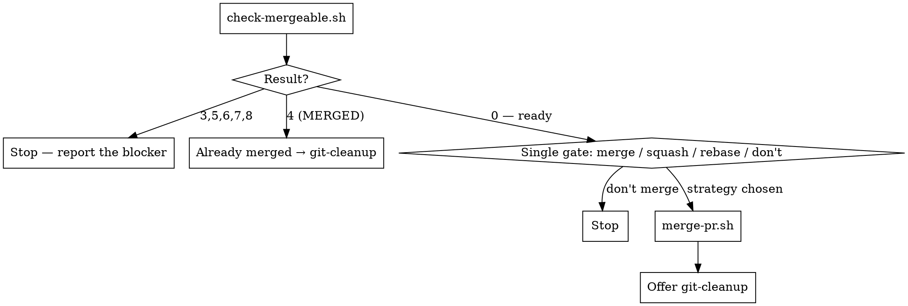

# Merge PR

Merge the open PR for the current branch — but only once it is genuinely mergeable: not a draft, no conflicts, CI green, branch protection satisfied.

This is the step between `git-pr` (opens it) and `git-cleanup` (deletes the branch afterwards).

**Merging is not reversible in the way a local mistake is.** Every gate below exists because bypassing it puts broken code on the default branch.

## Scripts

Helper scripts in `~/.config/opencode/skills/git-merge-pr/scripts/`:

| Script | Purpose |
|--------|---------|
| `check-mergeable.sh` | Read-only. PR state, draft, conflicts, merge state, CI checks, branch protection |
| `merge-pr.sh <pr> <squash\|merge\|rebase>` | Merge with an explicit strategy. Re-confirms the PR is still OPEN first |

## Workflow



## Steps

### Phase 1: Check It Is Actually Mergeable

1. Run from the repo root:
   ```bash
   bash -c 'cd "$(git rev-parse --show-toplevel)" && bash ~/.config/opencode/skills/git-merge-pr/scripts/check-mergeable.sh'
   ```

2. Act on the exit code. **Only 0 proceeds.**

   | Exit | Meaning | What to do |
   |---|---|---|
   | 0 | Ready | Continue to Phase 2 |
   | 2 | On the default branch | Stop — there is no PR here |
   | 3 | No PR for this branch | Stop. Offer `git-pr` to open one |
   | 4 | Already `MERGED`, or closed | If merged, go straight to `git-cleanup`. If closed, stop |
   | 5 | Draft | Stop. Offer `gh pr ready <n>` — but let the user decide |
   | 6 | Conflicts, or branch behind | Stop. Run `git-sync` on the branch, push, retry |
   | 7 | CI failing or pending | Stop. If pending, offer to wait. If failing, offer `git-push-branch` to fix and push |
   | 8 | Blocked by branch protection | Stop. A required review or status is missing |

3. Report the blocker in the user's terms — "CI is red on `test-integration`", not "exit 7".

### Phase 2: Choose the Merge Strategy

4. State the PR number and title as ordinary text, then ask with **one `AskUserQuestion`** —
   headed with that PR number so the dialog itself names what is about to merge
   (e.g. *"Merge PR #42: fix(cache): evict stale entries?"*):

   | Option | Result |
   |---|---|
   | **Merge commit** | Preserves every commit plus a merge commit. Always the first option — this is the default here |
   | **Squash and merge** | All branch commits become one commit on the default branch |
   | **Rebase and merge** | Replays each commit onto the default branch, linear, no merge commit |
   | **Don't merge** | Stop here and leave the PR open |

   **Merge commit** is always listed first. Never reorder these, and never present squash as the default.

   If the repo only allows some of these, GitHub rejects the others — report that plainly rather than retrying blindly.

5. **Picking a strategy is the go-ahead — merge on that answer.** This is the point of no return
   and the dialog already named the PR, so do not follow it with a second "are you sure?".
   Choosing the strategy and authorising the merge are one decision, not two.

### Phase 3: Merge

6. ```bash
   bash ~/.config/opencode/skills/git-merge-pr/scripts/merge-pr.sh <pr_number> <strategy>
   ```

   The script re-confirms the PR is still OPEN, then merges. It does **not** pass `--delete-branch` (cleanup is `git-cleanup`'s job, behind its own verified gate) and does **not** pass `--admin` (bypassing branch protection is never automatic).

### Phase 4: Hand Off to Cleanup

7. Report the merge — PR number, URL, strategy, merge commit.

8. Offer to run `git-cleanup` with `AskUserQuestion` — it verifies the merge landed, deletes the branch locally and remotely, and pulls the fresh default branch. Do not run it without that answer; the user may want to keep the branch around.

## Rules

- **One gate before the merge: the strategy dialog.** It names the PR and it authorises the merge. The only other dialog in the whole skill is the cleanup offer *after* the merge has landed
- **Every decision goes through `AskUserQuestion`, never a question in prose.** A text question reads as a sign-off — the turn looks finished and the user can't tell anything is pending. The dialog renders as something to select and submit. Ordinary text is for reporting state and for the final summary
- Never merge until `check-mergeable.sh` exits 0
- Never pass `--admin` or otherwise bypass branch protection — if it is blocked, it is blocked for a reason
- Never merge a draft PR without the user explicitly marking it ready
- Never merge with CI red; never merge with CI still pending without the user saying so
- Never resolve PR conflicts from this skill — that is `git-sync` on the branch, then push
- Always get an explicit confirmation of PR and strategy before merging — as the single strategy dialog, not as a confirmation chain
- Never delete the branch from here — hand off to `git-cleanup`
- Report blockers in plain terms, not exit codes

## Common mistakes

- **Merging on red.** A green PR page is not the same as green checks; `check-mergeable.sh` reads the actual check rollup.
- **Merging while checks are still pending.** Pending is not passing. Wait, or let the user decide.
- **Reaching for `--admin` when blocked.** Branch protection blocked the merge on purpose.
- **Resolving conflicts by merging anyway.** Conflicts get resolved on the branch with `git-sync`, then pushed.
- **Merging a draft.** Draft means the author is not done.
- **Deleting the branch as part of the merge.** `--delete-branch` skips the verified-MERGED gate and leaves the local default branch stale. Use `git-cleanup`.
- **Assuming the strategy.** Squash, merge and rebase produce materially different histories. Ask.
