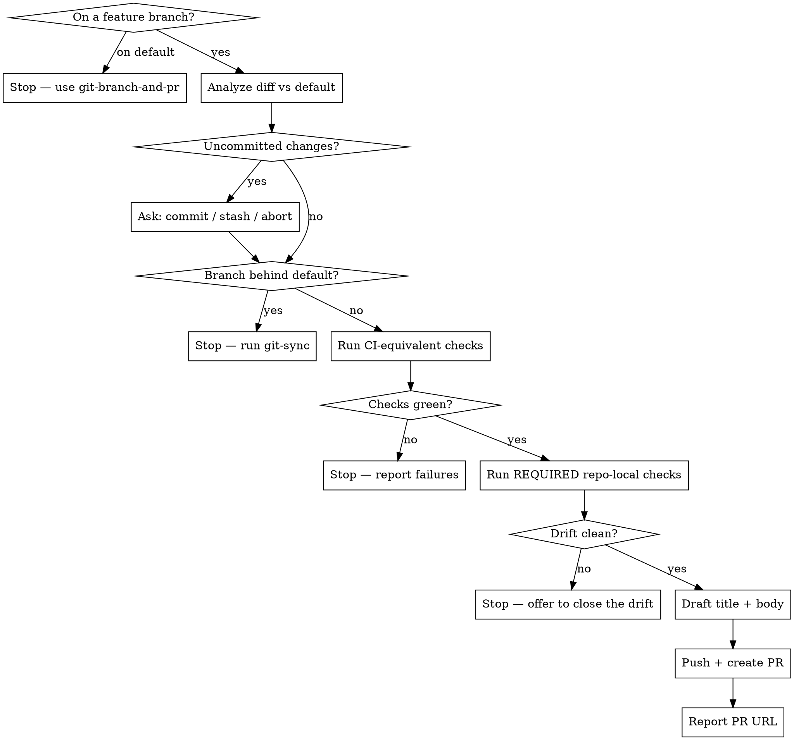

# PR From Branch

Take a feature branch from "I think it's done" to "PR is open and CI-ready": inspect everything that differs from the default branch, ensure nothing is uncommitted, run the checks CI will run, and only then open the PR with a description that reflects the actual diff.

**Do not open a PR on red.** If uncommitted work is unresolved, the branch is behind, or the local checks fail, stop and report. A PR opened on red just burns a CI cycle.

Use `git-branch-and-pr` instead when the work is still uncommitted on the default branch and needs a branch created for it.

## Scripts

Helper scripts in `~/.config/opencode/skills/git-pr/scripts/`:

| Script | Purpose |
|--------|---------|
| `analyze-branch.sh` | Branch info, uncommitted work, three-dot PR diff, up-to-date check, existing-PR check, CI workflows, local check commands, repo-local pre-PR checks, PR template |
| `repo-check.sh list \| run <name>` | List the repo's own declared pre-PR checks, or run one and gate on its result |
| `stage-files.sh [files\|--all]` | Stage files with sensitive-file warnings |
| `create-commit.sh <msg> [--amend]` | Create commit (rejects AI attribution) |
| `create-pr.sh <title> <body_file> [--draft]` | Push and open the PR (rejects AI attribution in title *and* body, refuses duplicates) |

## Repo-local pre-PR checks

Beyond lint/build/test, a repo often has consistency invariants that no generic command
knows about: an OpenAPI spec drifted from the routes the code registers, a checked-in
generated client stale against its schema, a migration no model reflects. The repo declares
these itself, in the frontmatter of one of its own `.claude/skills/*/SKILL.md`:

```yaml
pre-pr:
  command: .claude/skills/ocfo-api-sync/scripts/audit.sh
  when-paths: [server/handler.go, endpoint/, model/, openapi/]
  fail-on: 'missing [1-9]|stale [1-9]|mismatch [1-9]'
  fix: 'Run Phase B, then Phase C, and re-audit'
```

| Key | Meaning |
|---|---|
| `command` | Required. Run from the repo root |
| `when-paths` | Optional. Run only when the branch touches one of these; absent means always. `*` crosses `/`, and a bare directory covers everything beneath it |
| `fail-on` | Optional POSIX ERE matched against combined stdout+stderr. A match is a FAILURE regardless of exit status |
| `fix` | Optional one-liner telling the operator how to close the drift |

`fail-on` is what makes this reliable. Audit scripts routinely **exit 0 while reporting
drift** — `ocfo-api-sync`'s own audit does exactly that, and prints its `## MISSING` /
`## STALE` section headers unconditionally, with `(none)` beneath them when clean. Gating on
exit status would sail past the drift; gating on a header would fire on every clean run. The
regex has to key off something that is only present when the check genuinely fails, which is
usually a summary count.

`analyze-branch.sh` prints the discovered checks and which ones this branch's diff makes
REQUIRED. Repos that declare nothing still get a soft CANDIDATES list — drift-ish skills
found by keyword. That list is a prompt for your judgment, never a gate.

## Workflow



## Steps

### Phase 1: Analyze the Branch

1. Run the analysis from the repo root:
   ```bash
   bash -c 'cd "$(git rev-parse --show-toplevel)" && bash ~/.config/opencode/skills/git-pr/scripts/analyze-branch.sh'
   ```

2. Act on the exit code:

   | Exit | Meaning | What to do |
   |---|---|---|
   | 0 | Ready | Continue to Phase 3 |
   | 2 | On the default branch | Stop. Point the user at `git-branch-and-pr` |
   | 3 | No commits **and** a clean tree | Stop. There is genuinely nothing to PR |
   | 4 | Blockers listed | Resolve them in Phase 2 |
   | 5 | No commits yet, but work is uncommitted | Commit it first — see below — then re-run and continue |

   **Exit 5 — the fresh-worktree case.** An Orca ADE worktree starts on a branch that already
   exists with zero commits, with the work sitting uncommitted. `git-branch-and-pr` cannot take
   it (that skill requires the default branch), so this skill does.

   Print the commit message you propose as ordinary text, then put it to the user with **one
   `AskUserQuestion`** — **Commit it** / **Reword** (they type the replacement via Other) /
   **Abort**. On **Commit it**:
   ```bash
   bash ~/.config/opencode/skills/git-pr/scripts/stage-files.sh --all
   bash ~/.config/opencode/skills/git-pr/scripts/create-commit.sh "<confirmed message>"
   ```
   Re-run `analyze-branch.sh` and continue from its new verdict. Never commit without showing
   the message and getting that answer back — and never split it into two dialogs.

3. Read the **three-dot** diff (`origin/<default>...HEAD`) closely enough to write an honest summary. Three-dot is exactly what GitHub shows in the PR — the diff against the merge-base — so a description built from it matches what a reviewer sees. Do not infer the summary from commit subjects alone.

   If the script reported the diff as too large to inline, read it per file:
   ```bash
   git diff origin/<default>...HEAD -- <path>
   ```

4. If the script reported an **existing PR**, do not create a duplicate. Report its URL and offer to update the body with `gh pr edit <n> --body-file <file>` instead.

### Phase 2: Clear the Blockers

5. **`uncommitted-changes`** — surface the exact files **and the commit message you propose for
   them** as ordinary text, then ask with **one `AskUserQuestion`**:

   | Option | Action |
   |---|---|
   | **Commit it** | `stage-files.sh --all` + `create-commit.sh "<the message shown above>"`; re-run Phase 1 |
   | **Reword** | They type the replacement via Other; commit with that, then re-run Phase 1 |
   | **Leave it out** | `git stash push -u` so it is excluded from the PR; restore it after the PR is open |
   | **Abort** | Stop and let the user sort it out |

   The message rides along in this dialog — do not confirm the triage, then confirm the message
   in a second one. Never silently commit or discard. Untracked files count as uncommitted.

6. **`behind-default-branch`** — stop and tell the user to run `git-sync` first. Do not open a PR from a stale branch: the diff will not reflect what actually merges, and many CI guards reject it outright.

### Phase 3: Run the CI-Equivalent Checks

7. Read the workflow files the analysis listed as triggering on `pull_request`, and run their equivalent locally using the check commands the script found (package.json scripts, Makefile targets, just recipes). Typically that means the lint, build, and test commands.

8. If any check fails, **STOP**. Report the failure output verbatim, then put the next move to the user with **`AskUserQuestion`** — fix it now, or abandon the PR for now. Do not push and open the PR.

   If the repo has no discoverable checks, say so plainly in the report rather than implying the PR was verified.

9. Run every repo-local check the analysis marked **REQUIRED**:
   ```bash
   bash ~/.config/opencode/skills/git-pr/scripts/repo-check.sh run <name>
   ```
   The script applies that check's `fail-on` regex, so the verdict is the exit code, not your
   reading of the output: **0** passed, **1** FAILED, **2** not runnable (report it as a gap —
   never as a pass).

   Also read the CANDIDATES list, if any. If one of them plainly covers something this diff
   touches, run it by hand and offer to add a `pre-pr:` block so the next PR gates on it
   automatically.

10. If a REQUIRED check exits **1**, **STOP**. Print its report verbatim — the drift detail is
    the whole point, do not summarize it away — then put the next move to the user with
    **`AskUserQuestion`**:

    | Option | Action |
    |---|---|
    | **Close the drift now** | Run the owning skill as its `fix` line says, re-run `repo-check.sh run <name>` until it passes, commit the regenerated artifacts, then continue |
    | **Open the PR anyway** | Only if the drift is pre-existing and unrelated to this branch. Say so explicitly in the PR body under a `## Known drift` heading |
    | **Abort** | Stop and let the user sort it out |

    Never auto-fix: closing spec drift rewrites checked-in artifacts, which is a change the
    user has to see and agree to before it lands in their PR.

### Phase 4: Draft Title and Body

11. Draft:
   - **Title**: imperative, under 70 chars, scoped to the change (e.g. `fix(cache): evict stale entries on write`)
   - **Body** — use the repo's PR template if one exists, otherwise:
     ```
     ## Summary
     <1-4 bullets: what changed and why, grounded in the actual diff>

     ## Changes
     <notable files / areas touched, grouped by area if the diff is large>

      ## Test plan
      <the checks that were run and their result, plus anything verified manually>
      ```

12. Do not show the generated title or body for approval. On a clean run, open the PR ready for review immediately after drafting it. Only stop for the blocker decisions explicitly required in Phases 1-3.

    Identify the issue the PR resolves from an explicit issue URL/number in the request, the current Orca worktree's `linkedIssue`, or a branch named `issue-N` or `issue-N-*`. Verify the candidate with `gh issue view` before adding a closing reference. Append `Closes #N` to the body for an issue in the current repository, or `Closes OWNER/REPO#N` for an issue in another repository. If no candidate is available or verification fails, open the PR without a closing reference and report the gap.

### Phase 5: Push and Create

13. Write the generated body to a file, then create the ready-for-review PR:
    ```bash
    bash ~/.config/opencode/skills/git-pr/scripts/create-pr.sh "<title>" /tmp/pr-body.md
    ```
    The script pushes the branch (setting upstream if needed), refuses duplicates, and rejects AI attribution in both the title and the body. Pass `--draft` only when the user explicitly asked for a draft in their original request.

14. If it exits **2**, a PR already existed — report that URL rather than treating it as a failure.

### Phase 6: Report

15. Give the user the PR URL, the branch, the commit count, and which checks were run and passed. If work was stashed in Phase 2, restore it now and say so.

    Do not merge — opening the PR is the end of this skill. When review is done, `git-merge-pr` merges it and `git-cleanup` tidies up afterwards.

## Rules

- Run only on a feature branch that already has commits — refuse in Phase 1 otherwise
- NEVER open a PR with uncommitted work unresolved or the branch behind the default branch
- NEVER open a PR when the local checks are failing
- NEVER open a PR with a REQUIRED repo-local check failing, unless the user explicitly picked "open anyway" and the drift is recorded in the PR body
- NEVER close drift on the user's behalf — running the fix rewrites checked-in artifacts, which needs their say-so
- NEVER include "Co-Authored-By" or any "Claude Code" / AI attribution in commits **or** in the PR title/body — `create-pr.sh` rejects it in both
- **No gate on a clean run.** Generate the title and body, add a verified issue-closing reference when available, then push and open the PR. Do not ask the user to review or approve the PR message.
- **Every blocker decision goes through `AskUserQuestion`, never a question in prose.** A text question reads as a sign-off — the turn looks finished and the user can't tell anything is pending. The dialog renders as something to select and submit.
- Append a verified `Closes #N` or `Closes OWNER/REPO#N` line when the branch, Orca worktree, or request identifies the issue being resolved.
- NEVER force-push
- Never create a duplicate PR — check first, update the existing one instead
- The PR description must accurately reflect the real diff; do not invent work that is not in it
- Keep Summary on the "why", Changes on the "what"
- Use conventional commit style if the repo uses it
- Do not add `--draft` unless the user asked for one up front

## Common mistakes

- **Opening a PR on red.** Run the Phase 3 checks first and stop on any failure.
- **Missing uncommitted work.** `git status --porcelain` — untracked files count too.
- **Two-dot vs three-dot diff.** Use `origin/<default>...HEAD` (three-dot) to match what GitHub shows. Two-dot compares against the moving tip and will misreport the change.
- **PRing a stale branch.** If the branch is behind, the diff is not what will merge.
- **Fabricated description.** Summarize the real diff, not the commit subjects or a guess.
- **Duplicate PR.** Check for an existing PR before creating one; re-running this skill must be safe.
- **Asking to verify the PR message.** On a clean run, draft it from the actual diff and open the PR immediately.
- **Missing the issue link.** When a valid issue is available from the request, Orca worktree, or `issue-N` branch name, append the appropriate `Closes` reference so GitHub links and closes it on merge.
- **Merging the PR.** This skill opens it; review and merge are someone else's job.
- **Claiming checks passed when none exist.** If the repo has no discoverable checks, say that instead.
- **Reading an audit's output instead of its exit code.** `repo-check.sh run` already applied the `fail-on` regex. Exit 0 is a pass, exit 1 is a fail; don't overrule it because the report "looks fine".
- **Treating exit 2 as a pass.** A check that could not run is an unverified invariant. Report it as a gap.
