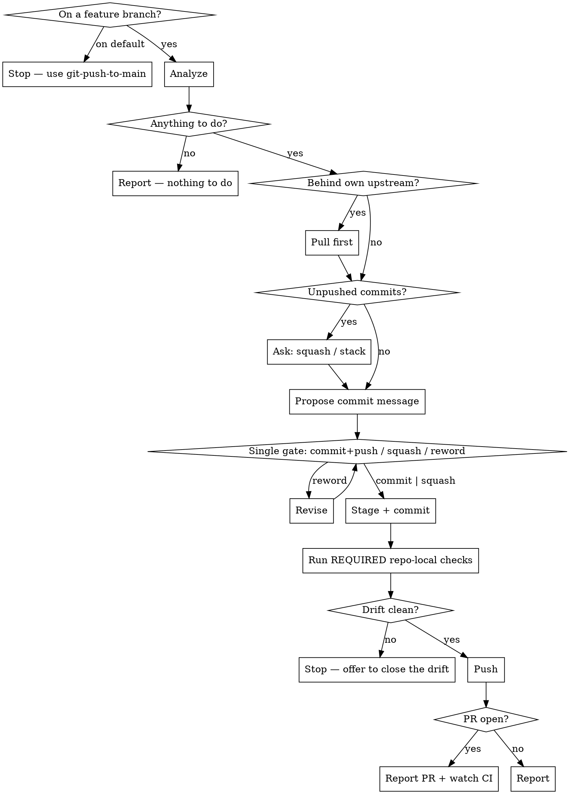

# Push Branch

Commit the current changes on a feature branch and push them. If a PR is open for the branch, this is what updates it.

This is the everyday loop: make a change, commit, push. Use it for review feedback and CI fixes on an existing PR.

Related: `git-commit` commits without pushing. `git-push-to-main` does the same job on the default branch. `git-pr` opens the PR in the first place.

## Scripts

Helper scripts in `~/.config/opencode/skills/git-push-branch/scripts/`:

| Script | Purpose |
|--------|---------|
| `analyze-branch.sh` | Status, diffs, unpushed commits, upstream drift, behind-default check, **open PR and its CI checks**, repo-local pre-PR checks |
| `repo-check.sh list \| run <name>` | List the repo's own declared pre-PR checks, or run one and gate on its result |
| `stage-files.sh [files\|--all]` | Stage files with sensitive-file warnings |
| `create-commit.sh <msg> [--amend]` | Create commit or amend (rejects AI attribution) |

The repo declares its own consistency checks — spec drift, stale generated artifacts — in a
`pre-pr:` frontmatter block on one of its `.claude/skills/*/SKILL.md`. `git-pr` documents the
contract in full; here it matters because a push to an open PR publishes the drift just as
surely as opening the PR did.

## Workflow



## Steps

### Phase 1: Analyze

1. Run from the repo root:
   ```bash
   bash -c 'cd "$(git rev-parse --show-toplevel)" && bash ~/.config/opencode/skills/git-push-branch/scripts/analyze-branch.sh'
   ```

2. Act on the exit code:

   | Exit | Meaning | What to do |
   |---|---|---|
   | 0 | Work to commit and/or push | Continue |
   | 2 | On the default branch | Stop. Point at `git-push-to-main` |
   | 3 | Clean tree, nothing unpushed | Report and stop |

3. Note from the output:
   - Whether the branch is **behind its own upstream** — someone else pushed to it. Pull before pushing or the push is rejected.
   - Whether an **open PR** exists, and the state of its CI checks.
   - Whether the branch is behind the default branch (not blocking; mention `git-sync` if CI needs it current).

### Phase 2: Pull If the Upstream Moved

4. If the analysis warned that the branch is behind its own upstream:
   ```bash
   git pull --ff-only
   ```
   If that cannot fast-forward, the branch has diverged from its remote. **Stop** — do not force anything. Surface it to the user; resolving it is `git-sync`'s conflict procedure, not a push.

### Phase 3: Note the Unpushed Commits

5. If there are already unpushed commits, say so in the Phase 4 summary — how many, and what the
   last one was. Squash-versus-stack is **not** its own question: it rides in the Phase 4 dialog
   as an option.

   If the last commit was already pushed, an amend rewrites published history — pushing it needs `--force-with-lease`. Say so in that summary, before the dialog offers squash, and only force-push with explicit confirmation.

### Phase 4: Review and Propose a Message

6. Summarize what changed and why, including the unpushed-commit state from Phase 3.

7. **Auto-propose a commit message.** Show the full message as ordinary text, then put it to the user with **one `AskUserQuestion`** — the only stop on a clean run, carrying both the message and where it lands:

   | Option | Action |
   |---|---|
   | **Commit and push** | Stage and commit with the message shown, then push. With unpushed commits present this is the **stack** choice — a new commit on top |
   | **Squash into the last commit** | Only offered when there are unpushed commits. `create-commit.sh --amend` with the message shown, then push |
   | **Reword** | They type the replacement via Other; commit and push with that |

   With no unpushed commits, drop the squash option. Never commit without that answer, never split the history choice and the message into two dialogs, and never follow this dialog with a separate "push it?" — approving the message *is* approving the push.

   If this commit addresses review feedback, say what it addresses — reviewers read commit subjects.

### Phase 5: Stage and Commit

8. ```bash
   bash ~/.config/opencode/skills/git-push-branch/scripts/stage-files.sh --all
   ```
   Or name specific files.

9. ```bash
   bash ~/.config/opencode/skills/git-push-branch/scripts/create-commit.sh "commit message here"
   ```
   Add `--amend` for the squash case. The script rejects AI attribution.

### Phase 6: Check the Repo's Own Invariants

10. Run every repo-local check the analysis marked **REQUIRED**:
    ```bash
    bash ~/.config/opencode/skills/git-push-branch/scripts/repo-check.sh run <name>
    ```
    The script applies that check's `fail-on` regex: **0** passed, **1** FAILED, **2** not
    runnable (a gap, not a pass). Relevance was judged against everything the PR will contain
    after this push, not just this commit — drift introduced earlier on the branch is still
    drift this push publishes.

    On **1**, **STOP before pushing**. Print the report verbatim, then use `AskUserQuestion`:
    close the drift now (run the owning skill per its `fix` line, re-check, commit the
    regenerated artifacts, then push), push anyway (only for pre-existing unrelated drift),
    or abort. Never close drift on your own — it rewrites checked-in artifacts.

    Skip this phase entirely when the analysis found no REQUIRED checks; do not invent one.

### Phase 7: Push

11. ```bash
    git push
    ```
    If there is no upstream:
    ```bash
    git push -u origin $(git branch --show-current)
    ```
    If the commit was amended and the original was already pushed, **get an explicit go-ahead through `AskUserQuestion` first** — force-push with lease, or stop and leave it — then:
    ```bash
    git push --force-with-lease
    ```
    Never plain `--force`.

### Phase 8: Report

12. State the commit, the branch, and that it pushed. If a PR is open, give its URL and note that the push updated it.

    If the user was fixing red CI, offer to check the run once it starts:
    ```bash
    gh pr checks <n> --watch
    ```
    Only run that if the user asks — it blocks until CI finishes.

## Rules

- Run only on a feature branch — refuse on the default branch
- Pull before pushing when the branch is behind its own upstream; never force past a rejected push
- NEVER push with a REQUIRED repo-local check failing, unless the user explicitly picked "push anyway"
- NEVER close drift on the user's behalf — running the fix rewrites checked-in artifacts, which needs their say-so
- **One gate on a clean run: the Phase 4 message dialog.** It carries the message, the squash-versus-stack choice, and the go-ahead to push. The only other dialogs are exceptions — a REQUIRED check failing, and a force-push after an amend
- **Every decision goes through `AskUserQuestion`, never a question in prose.** A text question reads as a sign-off — the turn looks finished and the user can't tell anything is pending. The dialog renders as something to select and submit. Ordinary text is for showing the proposed message and for the final report
- Always propose the commit message and wait for the dialog answer (or their replacement) before committing
- NEVER include "Co-Authored-By" or any "Claude Code" / AI attribution — `create-commit.sh` rejects it
- NEVER force-push without explicit user confirmation, and never plain `--force`
- Warn before amending a commit that was already pushed — it rewrites published history
- Keep commit messages short and focused on the "why"
- Use conventional commit style if the repo uses it
- The stage-files.sh script warns about sensitive files (.env, .pem, .key, etc.) and does not stage them

## Common mistakes

- **Splitting one commit across two dialogs.** Squash-or-stack, the message, and the push are decided together in the Phase 4 dialog.
- **Pushing without pulling when the remote branch moved.** The push is rejected, and the reflex fix — force — destroys someone else's commit.
- **Amending an already-pushed commit without saying so.** It rewrites published history and needs a force-push; reviewers lose the diff they were reading.
- **Using this on the default branch.** That is `git-push-to-main`, which has different guardrails.
- **Opening a second PR.** This skill pushes to the branch; the existing PR updates itself. Use `git-pr` only when there is no PR yet.
- **Blocking on `gh pr checks --watch` unprompted.** It waits for CI to finish. Only run it when asked.
- **Silently staging sensitive files.** Let `stage-files.sh` do the staging.
- **Pushing spec drift into a green PR.** A REQUIRED repo-local check failing is a red PR that CI may not even catch. Gate on `repo-check.sh run`'s exit code, not on how the report reads.
