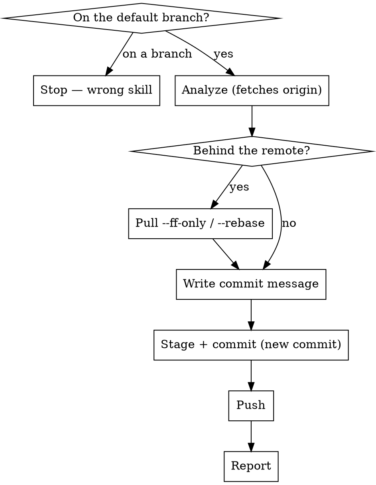

# Push to Main

Commit the current changes on the default branch and push directly to the remote. For verified work that does not need a PR.

**This skill runs start to finish without stopping.** Invoking it *is* the confirmation: the user has already decided the work belongs on the remote default branch. Do not ask which commit message to use, whether to squash or stack, or whether to push — decide, do it, and report at the end. The only two places the user is pulled in are a rebase conflict (Phase 2) and a force-push (Phase 6), because neither can be resolved correctly without them.

Related: `git-push-branch` does the same job on a feature branch. `git-branch-and-pr` wraps default-branch changes into a PR instead.

## Scripts

Helper scripts in `~/.config/opencode/skills/git-push-to-main/scripts/`:

| Script | Purpose |
|--------|---------|
| `analyze-changes.sh` | Status, **behind-remote check**, unpushed commits, diffs, recent commits, README check |
| `stage-files.sh [files\|--all]` | Stage files with sensitive-file warnings |
| `create-commit.sh <msg> [--amend]` | Create commit or amend previous (rejects AI attribution) |

## Workflow



## Steps

### Phase 0: Verify On the Default Branch

1. Check the current branch. If it is NOT the default branch (`main` or `master`), **stop immediately**:
   > "This skill only runs on the default branch. You're on `<branch>`. Use `git-push-branch` to commit and push there, `git-branch-and-pr` if you want a PR, or `git-sync` to bring main into this branch."

   Do not proceed.

### Phase 1: Analyze Repository State

2. Run the analysis script **from the repo root**:
   ```bash
   bash -c 'cd "$(git rev-parse --show-toplevel)" && bash ~/.config/opencode/skills/git-push-to-main/scripts/analyze-changes.sh'
   ```

   It fetches origin, then reports status, whether you are **behind the remote**, unpushed commits, staged/unstaged diffs, untracked files, recent commits, and the README check.

### Phase 2: Pull If the Remote Moved

3. If the analysis printed a `BLOCKER: behind origin/<default>` line, someone else pushed since you last pulled. A plain `git push` will be rejected. Integrate first:

   ```bash
   git pull --ff-only          # no local commits yet — clean fast-forward
   ```

   If you already have local commits, the fast-forward fails. Then:

   ```bash
   git pull --rebase           # replay your local commits on top of the remote
   ```

   If the rebase conflicts, resolve each conflict **with the user**, one block at a time, exactly as `git-sync` describes — label the sides "your work" and "origin/main", never the raw `ours`/`theirs` words, which invert during a rebase. Verify no markers survive before continuing.

   Never force-push past a rejected push. The rejection is protecting someone else's commit.

### Phase 3: Handle Unpushed Commits

4. If there are unpushed commits, **stack** — add a new commit on top. Do not ask, and do not amend.

   Stacking is the default here precisely because it never rewrites history: everything already on the remote stays untouched, and the push is a plain fast-forward. Amend only if the user asked for it in the same breath as invoking the skill ("squash this into the last commit"), and only when the target commit has not been pushed — an amend to a pushed commit needs a force-push, which is the one gate this skill keeps.

### Phase 4: Write the Commit Message

5. Read the diff and write the commit message yourself. Do not put it to the user for approval — no `AskUserQuestion`, no "does this look right?". Just print the message you are about to use as ordinary text and move on to Phase 5 in the same turn.

6. If README.md exists, check whether the changes affect documented content — new features, changed commands or structure, removed functionality. Update it only for meaningful user-visible changes, and fold that update into the same commit.

### Phase 5: Stage and Commit

7. Stage files:
   ```bash
   bash ~/.config/opencode/skills/git-push-to-main/scripts/stage-files.sh --all
   ```
   Or name specific files.

   The script deliberately leaves sensitive files (`.env`, `.pem`, `.key`, …) unstaged. Do not stage them to "complete" the commit and do not stop to ask about them — commit and push what did stage, and name the skipped files in the Phase 7 report.

8. Create the commit:
   ```bash
   bash ~/.config/opencode/skills/git-push-to-main/scripts/create-commit.sh "commit message here"
   ```
   The script refuses any message containing AI attribution.

### Phase 6: Push

9. ```bash
   git push
   ```
   If no upstream is configured:
   ```bash
   git push -u origin $(git branch --show-current)
   ```
   Run this immediately after the commit, in the same turn. The push is the point of the skill — never end a turn sitting on an unpushed commit.

   Only if history was rewritten (an explicitly requested amend of an already-pushed commit) does the user get a say: **ask through `AskUserQuestion` first** — force-push with lease, or stop and leave it — then:
   ```bash
   git push --force-with-lease
   ```
   Never plain `--force`, and never onto a branch other people are working on.

### Phase 7: Report

10. State the commit, that it pushed, and the new remote HEAD. If Phase 2 pulled anything, say what came in. If Phase 5 skipped sensitive files, list them.

## Rules

- Run only on the default branch — refuse in Phase 0 otherwise
- **Analyze → commit → push in one turn. No confirmation step anywhere in the normal path.** Invoking this skill is the go-ahead
- Write the commit message yourself; show it, don't submit it for approval
- The two exceptions that do stop for the user — a rebase conflict, and a force-push after a rewrite. Both need the user's judgment, not their permission. Use `AskUserQuestion` for the force-push call, never a question in prose: a text question reads as a sign-off, so the turn looks finished and the user can't tell anything is pending
- Default to stacking a new commit; amend only on explicit request, and only for unpushed commits
- Pull before pushing when behind the remote; never force past a rejected push
- NEVER include "Co-Authored-By" or any "Claude Code" / AI attribution — the script rejects it
- NEVER force-push without explicit user confirmation, and never plain `--force`
- Warn before amending a commit that was already pushed
- Keep commit messages short and focused on the "why"
- Use conventional commit style if the repo uses it
- Only update README when changes meaningfully affect documented content
- The stage-files.sh script warns about sensitive files (.env, .pem, .key, etc.) and does not stage them automatically

## Common mistakes

- **Pushing without pulling.** If anyone else pushed since your last pull, `git push` is rejected — and the reflex fix, force, destroys their commit. Phase 2 exists for this.
- **`git pull` without `--ff-only` or `--rebase`.** A plain pull invents a merge commit on the default branch when it has diverged.
- **Force-pushing the default branch.** Almost never correct. It rewrites history other people have already built on.
- **Amending an already-pushed commit silently.** It rewrites published history and needs a force-push. Stack instead.
- **Stopping to confirm the commit message.** The user invoked the skill to get the change onto the remote, not to review a proposal. Asking leaves the work sitting uncommitted until they come back.
- **Committing but not pushing.** A commit that never left the machine is a failed run of this skill.
- **Using this on a feature branch.** That is `git-push-branch`.
- **Pushing straight to main when the change wants review.** If it needs a second pair of eyes, use `git-branch-and-pr`.
