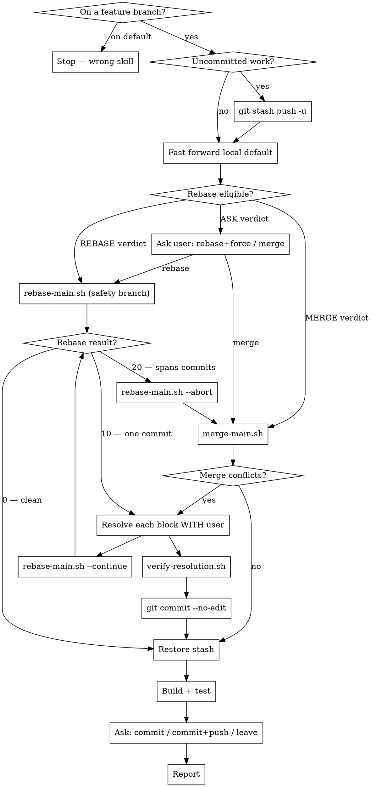

# Sync

Bring the latest default branch into the current feature branch. **Prefer a rebase; fall back to a merge when a rebase would be worse than one.** If either conflicts, walk the user through **every conflict, one at a time**, and apply the choice they make for each.

Never auto-pick a side. Every conflict is the user's decision.

Committing and pushing at the end is **optional** — the user may be syncing purely to keep developing.

## Scripts

Helper scripts in `~/.config/opencode/skills/git-sync/scripts/`:

| Script | Purpose |
|--------|---------|
| `analyze-state.sh` | Branch, uncommitted summary, default-branch divergence, upstream, **rebase eligibility verdict** |
| `sync-main.sh <default> <feature>` | Fetch origin; fast-forward the local default branch **by ref, never checking it out** |
| `rebase-main.sh <default>` / `--continue` / `--abort` / `--status` | Rebase behind a safety branch; tracks how many commits have conflicted and signals the bail-out |
| `merge-main.sh <default>` | Merge the default branch into the feature branch |
| `verify-resolution.sh [--quiet]` | Prove no conflict markers or unmerged paths survive |
| `stage-files.sh [files\|--all]` | Stage files with sensitive-file warnings |
| `create-commit.sh <msg> [--amend]` | Create commit (rejects AI attribution) |

## Strategy: rebase first, merge as fallback

A rebase replays your commits on top of the default branch, giving linear history and no merge commit. That is the default. But a rebase replays **each commit in turn**, so a conflicting hunk can resurface once per commit — a 15-commit branch with a genuinely conflicting file means resolving the same collision up to 15 times, each against a partial tree that never existed. A merge resolves the same collision **once**, against the final tree.

So: try the rebase, but bail to a merge the moment it stops being cheap.

### Bail out to a merge if ANY of these hold

`analyze-state.sh` checks the first three up front and prints a verdict. `rebase-main.sh` detects the fourth mid-rebase and exits **20**.

| Condition | Why it kills the rebase |
|---|---|
| **Branch is pushed AND has an open PR** | Rebase rewrites SHAs → needs `--force-with-lease`, which can orphan review comments pinned to old SHAs |
| **Branch already contains a merge commit** | Rebase flattens or chokes on it (`--rebase-merges` is a footgun) |
| **Branch is pushed with no PR** | Not disqualifying, but needs a force-push — **ask with `AskUserQuestion`**, never assume |
| **Conflicts hit more than one commit** | You are re-resolving the same collision per commit. Abort and merge |
| **User asks for a merge** | Their call |

A conflict confined to **one** commit is fine — resolve it and continue.

## Terminology: OURS and THEIRS invert between merge and rebase

**This is the single easiest thing to get backwards. Read it every time.**

Git labels the two sides of a conflict relative to *the commit currently being applied*, so the labels **swap** depending on the operation:

| Operation | OURS = | THEIRS = |
|---|---|---|
| `git merge <default>` (on your branch) | **your branch** (`HEAD`) | **the default branch** (incoming) |
| `git rebase <default>` (on your branch) | **the default branch** (the new base) | **your commit** being replayed |

During a **rebase**, "ours" is the default branch and "theirs" is *your own work* — the opposite of what intuition says. Git is replaying your commit *onto* main, so main is what already exists ("ours") and your commit is what is arriving ("theirs").

**Never present a conflict to the user using the raw `ours`/`theirs` words.** Always translate to the concrete side:

> "**Your branch** has X. **main** has Y."

That phrasing is correct under both operations and cannot be inverted by mistake.

When a file conflicts, git brackets the two versions in place with three marker lines at column 0 — an opener, a divider, and a closer. The opener and closer are tagged with the commit or ref each body came from; read those tags to know which body is which rather than assuming an order. Resolving a block means replacing all three marker lines plus one or both bodies with the final content.

## Workflow



## Steps

### Phase 1: Analyze

1. Run from the repo root:
   ```bash
   bash -c 'cd "$(git rev-parse --show-toplevel)" && bash ~/.config/opencode/skills/git-sync/scripts/analyze-state.sh'
   ```

2. Refuse to proceed if:
   - **Exit 2** — on the default branch. Use `git-push-to-main` or `git-branch-and-pr`.
   - **Exit 3** — a merge is already in progress. The user must finish or abort it first.
   - **Exit 4** — the local default branch has unpushed commits or has diverged from origin. Bail out: *"Your local `<default>` has commits that aren't upstream. This skill won't overwrite them — push or rebase your `<default>` first."*

3. Note the **REBASE ELIGIBILITY** verdict — it drives Phase 4.

### Phase 2: Stash Uncommitted Work

4. If there are uncommitted changes (tracked or untracked):
   ```bash
   git stash push -u -m "git-sync autostash"
   ```
   Record that a stash exists. If there is nothing uncommitted, skip this and note that there will be no work to restore or commit at the end.

### Phase 3: Fetch, and Fast-Forward the Local Default Branch by Ref

5. ```bash
   bash ~/.config/opencode/skills/git-sync/scripts/sync-main.sh <default> <feature>
   ```
   On failure (exit 2) the local default branch diverged. Restore the stash and report.

   **The integration target is `origin/<default>`, not the local branch.** Nothing here ever runs
   `git checkout`. A repo can have several checkouts — git worktrees, as Orca ADE uses — and git
   refuses to check out a branch already checked out elsewhere, so switching to the default branch
   fatals in every linked worktree. Updating the local default is a convenience done by ref, and is
   skipped entirely when another worktree holds it. Phases 5a and 5b rebase/merge `origin/<default>`.

### Phase 4: Choose the Strategy

6. Follow the Phase 1 verdict:

   | Verdict | Action |
   |---|---|
   | `REBASE` | Go to Phase 5a |
   | `MERGE` | Go to Phase 5b. State the reason |
   | `ASK USER` | The branch is pushed with no open PR. Ask with `AskUserQuestion`: **rebase** (needs `git push --force-with-lease` afterwards) or **merge** (no force-push). Recommend merge unless they want linear history |

   State which you chose and **why** before running it.

### Phase 5a: Rebase

7. ```bash
   bash ~/.config/opencode/skills/git-sync/scripts/rebase-main.sh <default>
   ```
   It creates a safety branch (`backup/pre-rebase-<branch>-<sha>`) before touching anything, then rebases.

   | Exit | Meaning | What to do |
   |---|---|---|
   | 0 | Clean | Phase 7 |
   | 10 | Conflicts, confined to one commit | Phase 6, then `--continue` |
   | 20 | **Bail out** — conflicts span more than one commit | `rebase-main.sh --abort`, then Phase 5b. Tell the user why you switched |
   | 1 | Error | Report |

8. After resolving (Phase 6):
   ```bash
   bash ~/.config/opencode/skills/git-sync/scripts/rebase-main.sh --continue
   ```
   It refuses to continue while markers remain, then re-reports. Loop until exit 0, or until exit 20 sends you to the merge path.

   The user can abort at any point with `--abort`, which restores the pre-rebase state exactly.

### Phase 5b: Merge

9. ```bash
   bash ~/.config/opencode/skills/git-sync/scripts/merge-main.sh <default>
   ```
   - Exit 0 — clean merge, already committed. Go to Phase 7.
   - Exit 10 — conflicts. Go to Phase 6, then finalize at step 14.

### Phase 6: Resolve Each Conflict WITH the User

Identical for both paths. Handle **one file at a time**; `Read` it and process its conflict blocks top to bottom.

10. For **each conflict block**, show the user both sides with enough surrounding context to decide. **Label them by concrete side — "your branch" vs "main" — never by the raw `ours`/`theirs` words**, which invert between rebase and merge. Then ask with `AskUserQuestion`:

    | Option | Result |
    |---|---|
    | **Keep your branch's version** | Replace the whole block with that body |
    | **Keep main's version** | Replace the whole block with that body |
    | **Keep both** | Both bodies, in the order the user wants, markers removed |
    | **Let me decide** | User describes the merge; you write it, show them, confirm before applying |

11. Apply each decision with `Edit`: replace the **entire** block — all three markers plus both bodies — with the chosen content. Leave no marker line behind.

12. Ask **per block, not per file**. One file may hold several independent conflicts the user wants resolved differently. If the user says "same as last" or "all mine", honor it without re-asking, but still apply each block and confirm you both mean the same side.

13. When every file is done:
    ```bash
    bash ~/.config/opencode/skills/git-sync/scripts/verify-resolution.sh
    ```
    If it exits 1, go back — do not commit a file with markers.

14. **Merge path only** — finalize:
    ```bash
    git add -A && git commit --no-edit
    ```
    (Git's default merge message; it contains no AI attribution.)

    **Rebase path** — nothing to commit; `--continue` already committed each replayed commit.

    If the user wants to abandon: `rebase-main.sh --abort` or `git merge --abort`, then restore the stash and stop.

### Phase 7: Restore Uncommitted Work

15. If a stash was created in Phase 2:
    ```bash
    git stash pop
    ```
    If the pop itself conflicts, repeat Phase 6 for those files. **Do not drop the stash** until it applies cleanly or the user explicitly confirms.

### Phase 8: Verify the Integrated Tree Actually Works

16. Zero conflicts does not mean zero breakage. Integrating the default branch can break your branch through a **semantic conflict** — a renamed function, a changed signature, a new interface method — which git cannot see and which only surfaces at build time.

    Run the repo's build and test commands (check `package.json` scripts, `Makefile` targets, or the CI workflow). If they break, surface it to the user; do not paper over it.

    If the repo has no discoverable build or test command, say so rather than implying the sync was verified.

### Phase 9: Decide What to Do With the Restored Work

17. Only if Phase 7 restored uncommitted work. Summarize it, then ask with `AskUserQuestion`:

    | Option | Action |
    |---|---|
    | **Leave it uncommitted** | Stop here — the user is still developing. This is the common case for a mid-work sync |
    | **Commit only** | Propose a message, confirm it through another `AskUserQuestion`, `stage-files.sh --all` + `create-commit.sh`. No push |
    | **Commit and push** | The above, then `git push` (or `git push -u origin <branch>` if there is no upstream) |

    Never commit without proposing the message and getting an answer back — the message goes to the user in the dialog too, never as a prose question.

18. **If you rebased a branch that was already pushed**, the push needs `git push --force-with-lease`. Tell the user and put the call to **them** with `AskUserQuestion` — force-push with lease, or leave it unpushed. Never force-push unprompted, and never plain `--force`.

### Phase 10: Report

19. State plainly:
    - which strategy was used — **rebase** or **merge** — and **why**, especially if you started a rebase and bailed out
    - how many commits were replayed, or what was merged in
    - how many conflicts there were and how each was resolved
    - the new HEAD, and for a rebase the `backup/pre-rebase-*` branch left behind
    - whether the build and tests pass
    - what happened to the uncommitted work, and whether anything was pushed

## Rules

- **Every decision goes through `AskUserQuestion`, never a question in prose.** A text question reads as a sign-off — the turn looks finished and the user can't tell anything is pending. The dialog renders as something to select and submit. This covers every conflict block, the strategy choice, the commit message, and the force-push call. Ordinary text is for showing conflict context and for the final report
- Refuse to run on the default branch, or when a merge or rebase is already in progress
- Bail out if the local default branch has diverged from origin
- Never discard the user's uncommitted work — stash first, restore last, never drop without explicit confirmation
- Resolve conflicts **per block**, with user confirmation before applying each one
- Never show the user the raw `ours`/`theirs` words — say "your branch" and "main"
- Never use `-X ours` / `-X theirs`: they resolve silently and defeat the point
- Never rebase without the safety branch (`rebase-main.sh` creates it; do not bypass the script)
- NEVER commit while any file remains in conflicted state — `verify-resolution.sh` must pass
- NEVER include "Co-Authored-By" or any "Claude Code" / AI attribution — `create-commit.sh` rejects it
- NEVER force-push without explicit user confirmation, and never plain `--force`
- Committing and pushing are opt-in, not automatic — ask in Phase 9
- Use conventional commit style if the repo uses it

## Common mistakes

- **Inverting OURS/THEIRS on a rebase.** During a rebase, `ours` is the default branch and `theirs` is *your* commit — the opposite of a merge. Never show the raw words.
- **Rebasing through a conflict that spans many commits.** You resolve the same collision once per commit against trees that never existed. `rebase-main.sh` exits 20 for exactly this — abort and merge.
- **Rebasing a pushed branch with an open PR.** Needs a force-push and can orphan review comments pinned to the old SHAs.
- **Force-pushing unprompted.** Never. `--force-with-lease`, and only when the user says so.
- **Rebasing without a safety branch.** The old commits become unreachable the moment the branch ref moves.
- **Auto-resolving to "speed things up."** Every conflict is the user's call.
- **Asking per file instead of per block.** One file can hold several conflicts wanting different answers.
- **Committing with leftover markers.** Run `verify-resolution.sh` — `git diff --check` alone misses markers that are already staged.
- **Declaring victory on a clean sync without building.** Semantic conflicts compile-fail and git cannot see them.
- **Forcing a commit the user didn't want.** A mid-work sync usually ends with the work still uncommitted. Ask.
- **Dropping the stash after a conflicted pop.** The stash is the only copy until it applies cleanly.
